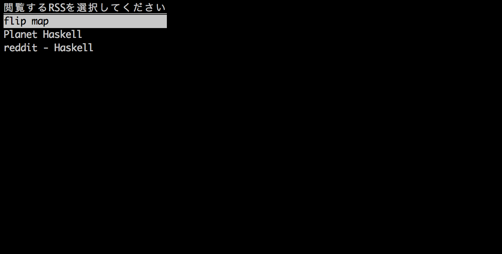
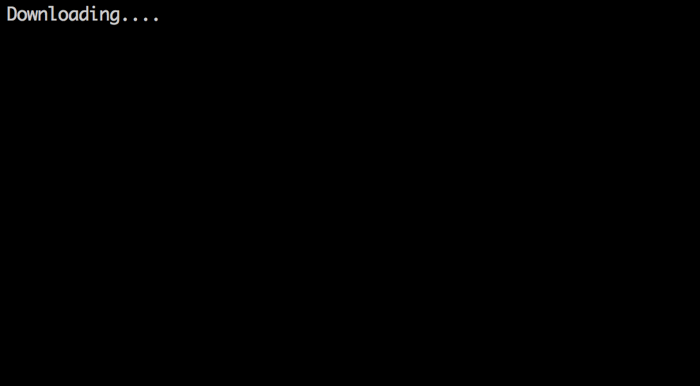
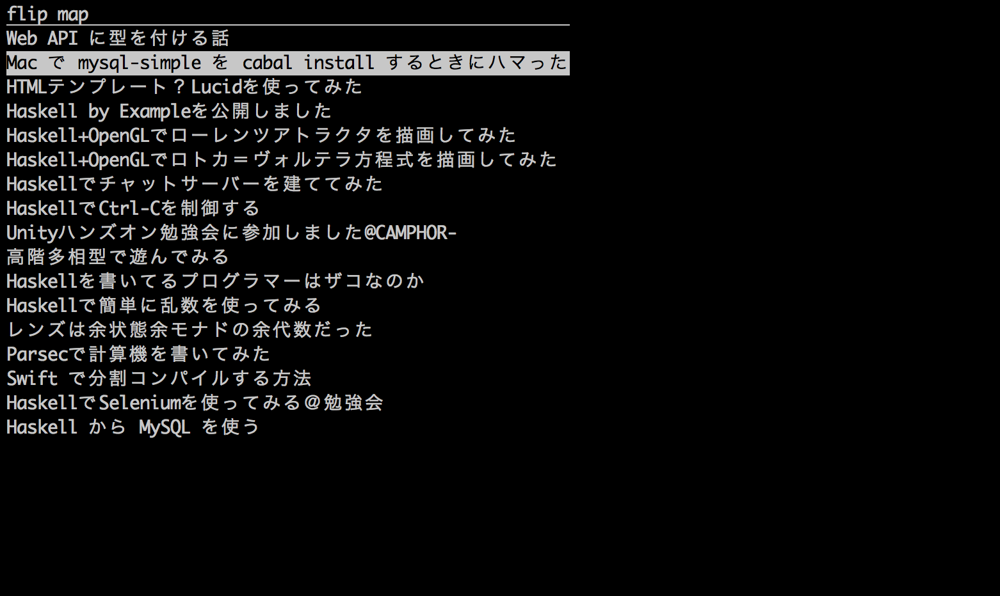

#Vtyを使って作る簡単なRSSリーダー
[vty](https://hackage.haskell.org/package/vty)はテキストベースのUIを作れるようになるライブラリです。頑張ればvimのようなものを作れるようになります（がんばれば！）

このvtyを使って簡単なRSSリーダーを作ったので簡単に解説してみたいと思います。完成したものはこのレポジトリを`git clone`して`cabal install && cabal run`をすれば試すことができます。

##HelloWorld
まずはVtyの基本的な例です。実際に手元で動かしてみてください！

```haskell
import Graphics.Vty

main = do
    vty <- standardIOConfig >>= mkVty
    update vty . picForImage $ string (defAttr `withForeColor` green) "Hello vty"
    e <- nextEvent vty
    shutdown vty
    print e
```

`cabal install vty` を忘れずに！この例は[Graphics.Vty](https://hackage.haskell.org/package/vty/docs/Graphics-Vty.html)に載っているものをもう少し簡略化したものです。まず

```haskell
vty <- standardIOConfig >>= mkVty
```

で操作の対象になる`Vty`型の値`vty`を作成します。UIに関する処理はこの`vty`を通じて行っていきます。

```haskell
update vty . picForImage $ string (defAttr `withForeColor` green) "Hello vty"
```

`string (defAttr 'withForeColor' green) "Hello vty"`で文字色が緑で"Hello vty"と書かれた`Image`を作成し`picForImage`を使って`Picture`に変換したあと`update vty`で画面に描画しています。

```haskell
e <- nextEvent vty
```

で何らかのイベントを待ち、イベントが来たら

```haskell
shutdown vty
```

で`vty`を安全に終了して

```haskell
print e
```

で最後に起こったイベントを表示する、と言った流れです。

##アプリを設計する
Hello World を見て分かるようにVtyを使ったプログラムでは最初に`mkVty`で作ったVtyの値を色んな所で使いまわします。なのでアプリでは最初に作った`Vty`の値を`Reader`モナドに入れて引き回すようにするのがいいでしょう。またプログラムが予期せぬ処理で終わってしまうことも考えて`Except`モナドの中にも入れましょう。もちろん`Vty`をアップデートするのに`IO`モナドの中である必要もあります。扱いたい文脈が3つも出てきてしまったわけですがこんな時は慌てずにモナド交換子を使いましょう。以下のように型を作ります。

```haskell
import Control.Monad.Except
import Control.Monad.Reader
import Control.Monad.IO.Class

data AppException = AppEscape

type App = ExceptT AppException (ReaderT Vty IO)

runApp :: Vty -> App a -> IO (Either AppException a)
runApp vty = (flip runReaderT vty) . runExceptT
```

`AppException`はアプリが吐くエラーの種類で、必要であれば追加していきます。`App`の値を作って`runApp`で実行するという寸法です。

##画面を設計する
それでは実際にRSSリーダーを作っていきましょう。画面は

* 登録してるRSSを選択する(selectionView)
* RSSを取ってくる(loadingView)
* 記事を選択する(rssfeedView)
* 記事を読む(previewView)

の四つにしましょう。とりあえず型だけ実装してしまいます。

```haskell
data RSS = RSS { _title :: String, _url :: String } deriving Show

selectionView :: [RSS] -> Int -> App RSS
selectionView _ _ = throwError AppEscape

loadingView :: RSS -> App Document
loadingView _ = throwError AppEscape

data RSSFeedViewAction = RSSFeedViewBack | RSSFeedViewPreview String

rssfeedView :: Document -> Int -> App RSSFeedViewAction
rssfeedView _ _ = throwError AppEscape

previewView :: String -> App ()
previewView _ = throwError AppEscape
```

データの流れを意識して画面遷移だけを先に実装してしまいます。

```haskell
main :: IO ()
main = do
    vty <- standardIOConfig >>= mkVty
    rssList <- getRSSList
    runApp vty . forever $ do
        rss <- selectionView rssList 0
        doc <- loadingView rss
        fix $ \loop -> do
            act <- rssfeedView doc 0
            case act of
                RSSFeedViewBack        -> return ()
                RSSFeedViewPreview url -> previewView url >> loop
    shutdown vty
```

`main`関数はこれで完成です！注目すべきは`main`の中の`runApp`の部分です。モナドの計算だけを使って画面遷移を記述しています。

##登録されてるRSSを取得する
RSSの登録はローカルのYamlファイルに記述していくことにしましょう。

```yaml
-
    title: flip map
    url  : http://lotz84.github.io/feed.xml
-
    title: Planet Haskell
    url  : http://planet.haskell.org/rss20.xml
-
    title: reddit - Haskell
    url  : https://www.reddit.com/r/haskell/.rss
```

Yamlのアクセスには[yaml-light](https://hackage.haskell.org/package/yaml-light), [yaml-light-lens](https://hackage.haskell.org/package/yaml-light-lens)を使います

```haskell
import Data.Yaml.YamlLight
import Data.Yaml.YamlLight.Lens

getRSSList :: IO [RSS]
getRSSList = do
    yaml <- parseYamlFile "rss.yml"
    let y2r y = do
            title <- y ^? key "title" . _Yaml
            url   <- y ^? key "url"   . _Yaml
            return $ RSS title url
    return $ yaml ^.. each . folding y2r
```

`y2r`は`YamlLight`から独自に定義した`RSS`に変換する関数です。この関数は失敗するかもしれないのですが`folding`を使うことで失敗した値を排除しています

##RSSの選択画面
selectionViewの中身を実装していきましょう



```haskell
selectionView :: [RSS] -> Int -> App RSS
selectionView rssList selecting = do
    vty <- ask
    let header       = string (defAttr `withStyle` underline) "閲覧するRSSを選択してください"
        tableStyle n = if n == selecting then defAttr `withStyle` reverseVideo else defAttr
        table        = vertCat $ map (\(rss, n) -> string (tableStyle n) (_title rss)) $ zip rssList [0..]
        pic          = picForImage $ header <-> table
    liftIO $ update vty pic
    e <- liftIO $ nextEvent vty
    case e of
        EvKey KEsc        _ -> throwError AppEscape
        EvKey KEnter      _ -> return $ rssList !! selecting
        EvKey (KChar 'j') _ -> selectionView rssList (min (length rssList - 1) (selecting + 1))
        EvKey (KChar 'k') _ -> selectionView rssList (max 0 (selecting - 1))
        _                   -> selectionView rssList selecting
```

やっていることは単純で選択されている項目だけ色を反転しているだけです。`j`と`k`を押されると選択が上下に移動します。`Enter`が押されるとその時選択されている値が返却されます。

##ローディング画面
RSSを取得してくる画面を実装していきましょう



RSSが選択されたらその情報をWebまで取りに行き返ってきたXMLをパースしなければいけません。物によっては時間がかかるのでローディング画面を出してあげたほうが親切だと思います。しかしデータの処理とローディングのアニメーションは直列に書くことはできないので情報を取得してくるところは非同期で書くことにしましょう。XMLのパースには[xml-conduit](https://hackage.haskell.org/package/xml-conduit)を使います

```haskell
import Control.Concurrent
import Control.Concurrent.MVar
import Network.HTTP.Conduit
import Text.XML

loadingView :: RSS -> App Document
loadingView rss = do
    vty    <- ask
    result <- liftIO $ newEmptyMVar
    liftIO . forkIO $ do
        body <- simpleHttp (_url rss)
        let doc = parseLBS_ def body
        putMVar result doc
    liftIO . ($ 0) . fix $ \loop n -> do
        let gauge = string defAttr $ "Downloading" ++ take n (repeat '.')
            pic   = picForImage gauge
        update vty pic
        threadDelay 200000
        doc <- tryTakeMVar result
        case doc of
            Nothing  -> loop (n+1)
            Just doc -> return doc
```

`result`に値が入るまで`.`の個数を増やしつつループしているだけですね

##記事の選択画面


"RSSの選択画面"と処理はほとんど同じです。違うのはデータが入っているのが`Document`型の値なのでパースする必要があるところです。XMLのパースには[xml-lens](https://hackage.haskell.org/package/xml-lens)を使います

```haskell
import Data.Text.Lens
import Text.XML.Lens
import qualified Text.XML.Lens as XML

rssfeedView :: Document -> Int -> App RSSFeedViewAction
rssfeedView doc selecting = do
    vty <- ask
    let title = maybe "no title" id $ doc ^? root ./ el "channel" ./ el "title" . XML.text . unpacked
        items = doc ^.. root ./ el "channel" ./ el "item" ./ el "title" . XML.text .unpacked
        header    = string (defAttr `withStyle` underline) $ title
        tableStyle n  = if n == selecting then defAttr `withStyle` reverseVideo else defAttr
        table = vertCat $ map (\(item, n) -> string (tableStyle n) item) $ zip items [0..]
        pic       = picForImage $ header <-> table
    liftIO $ update vty pic
    e <- liftIO $ nextEvent vty
    case e of
        EvKey KEsc        _ -> return RSSFeedViewBack
        EvKey KEnter      _ -> do
            let url = (!! selecting) $ doc ^.. root ./ el "channel" ./ el "item" ./ el "link" . XML.text . unpacked
            return $ RSSFeedViewPreview url
        EvKey (KChar 'j') _ -> rssfeedView doc (min (length items - 1) (selecting + 1))
        EvKey (KChar 'k') _ -> rssfeedView doc (max 0 (selecting - 1))
        _                   -> rssfeedView doc selecting
```

この実装はよく考えると毎フレームXMLをパースすることになるので少し効率が悪いですね！予め必要な情報だけ持ったデータ構造に変換してやればもう少し動作が早くなりそうです（今のままでも十分速いですが）

##閲覧画面とまとめ

```haskell
import System.Process

previewView :: String -> App ()
previewView url = do
    liftIO $ createProcess $ shell $ "open " ++ url
    return ()
```

最後は閲覧画面です。が、ターミナル上でWebページを表示するのはかなり大変そうなので外部のアプリに委譲することにします。

以上が簡単な解説です。完成したコードは110行しかなくずいぶん簡潔に書くことができました。完成したコードは[ここ](https://github.com/lotz84/cli-rss-reader/blob/master/Main.hs)から見ることができます。質問＆コメントあれば[issue](https://github.com/lotz84/cli-rss-reader/issues)までお願いします。Starもお願いします！
